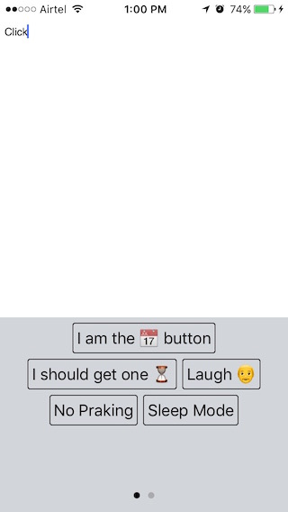
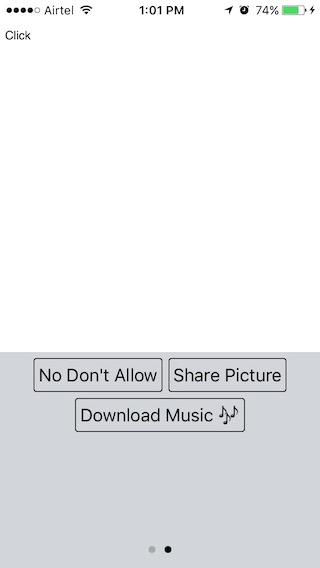

# XpdButtons

[](https://travis-ci.org/xpd54/XpdButtons)
[](http://cocoapods.org/pods/XpdButtons)
[](http://cocoapods.org/pods/XpdButtons)
[](http://cocoapods.org/pods/XpdButtons)




XpdButtons is a library which generate a view with multiple buttons dynamically arrange according to button title length. Number of row in one page view have to be fix and if there is more buttons, it will show up in next page view.

## Usage
### XpdButtonContainer
`XpdButtonContainer` creates a controller where you can set your button properties and the way button looks. Then you can get a `UIView` in which buttons are properly arranged.

### Creating button view
[buttonproperties](https://github.com/xpd54/XpdButtons#buttonproperties) is an Array which holds dictionary of buttonInfo and title.
`#import<XpdButtons/XpdButtonContainer.h>` In your `.h` file.

```objective-c
XpdButtonContainer *buttonPageController = [[XpdButtonContainer alloc] init];
// self <--- in which viewContoller you gonna use the view.
buttonPageController.delegate = self;
buttonPageController.buttonProperties = buttonproperties; // NSArray
// Set your other properties for buttons.
buttonPageController.numberOfMaxRow = 3; // Default is 2
UIView *buttonView = [buttonPageController getXpdButtonsViewForParentViewController:self];
```
### XpdButtonAction
`XpdButtonAction` @protocol for detecting buttons tap.
Implement following method to know when buttons got clicked. 
`- (void) buttonGetClicked:(XpdButton *)button;`

## XpdButtonContainer @property
### buttonProperties
`buttonProperties` if an Array of Dictionary with two keys.

1. `title` :- title is which gonna be shown on button title.
2. `buttonInfo` :- buttonInfo is Dictionary.

`Tips :- In following delegate method buttonInfo will be useful to take action on button tap.`

`- (void) buttonGetClicked:(XpdButton *)button;`

##### Example

```objective-c
NSArray *properties = @[
                            @{
                                @"title" : @"button 1",
                                @"buttonInfo" : @{@"key" : @"value"}
                            },
                            @{
                                @"title" : @"button 2",
                                @"buttonInfo" : @{@"key" : @"value"}
                            }];
```

```objective-c
- (void) buttonGetClicked:(XpdButton *)button {
            if ([[button.buttonInfo objectForKey:@"somekey"] isEqualToString:@"somevalue"]) {
                // Do something
            }
            if ([button.title isEqualToString:@"Button 1"]) {
                // Do something
            }                                           
        }
```

### numberOfMaxRow
`numberOfMaxRow` How many maximum row should be in one page view. **Default number of maximum row is 2**

### buttonBorderColor
`buttonBorderColor` Set button border color. **Default is black.**

### buttonTitleColor
`buttonTitleColor` Set Button title color. **Default is black.**

### buttonHighlightedTitleColor
`buttonHighlightedTitleColor` Set Button title color in Highlighted condition. **Default is red.**

### pageIndicatorTintColor
`pageIndicatorTintColor` Set Page Indicator Tint color. **Default is lightGray.**

### currentPageIndicatorTintColor
`currentPageIndicatorTintColor` Set Current Page indicator tint color. **Default is black.**

## Method
```objective-c 
-(UIView *) getXpdButtonsViewForParentViewController:(UIViewController *)parent;
```
Returns a view which holds all buttons which was set in [buttonProperties](https://github.com/xpd54/XpdButtons#buttonproperties)


## How to run Example

To run the example project, clone the repo, and run `pod install` from the Example directory first.

## Installation

XpdButtons is available through [CocoaPods](http://cocoapods.org). To install
it, simply add the following line to your Podfile:

```ruby
pod "XpdButtons"
```
## Contribution
You wanna help to make it better and easy to use. Send me pull request 😃.
## Author

Ravi Prakash, raviprakash.xpd54@gmail.com

## License

XpdButtons is available under the MIT license. See the LICENSE file for more info.
